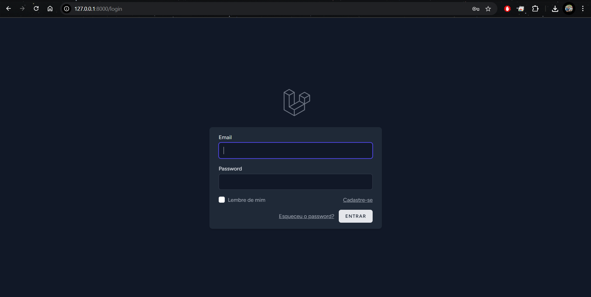
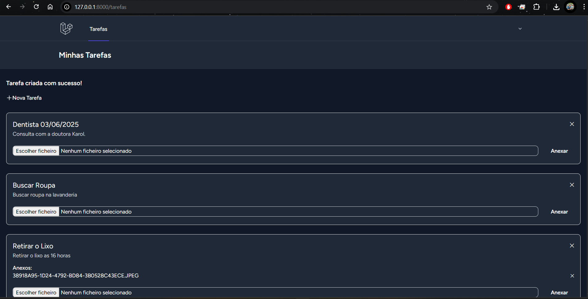

# 📁 TaskHub – Painel Pessoal de Tarefas com Anexos

O **TaskHub** é um painel pessoal de tarefas feito com Laravel, onde cada usuário pode cadastrar suas próprias tarefas e anexar arquivos. Ideal para organizar atividades e centralizar documentos em um único lugar, com visual moderno, intuitivo e responsivo.


---

## ✨ Funcionalidades

- Autenticação de usuários (registro/login)
- Painel pessoal de tarefas
- Criação e exclusão de tarefas
- Upload e exclusão de arquivos por tarefa
- Interface escura e responsiva com Tailwind CSS
- Proteção de acesso via middleware `auth`

---

## 🛠 Tecnologias utilizadas

- Laravel 10
- Laravel Breeze (Blade)
- Tailwind CSS 3
- PHP 8.1+
- MySQL
- Vite

---

## 🖼️ Screenshots

### 🔐 Tela de Login



### ✅ Painel de Tarefas



---

## 🚀 Como rodar localmente

```bash
# 1. Clone o projeto
git clone https://github.com/romariojhonatan/taskhub.git
cd taskhub

# 2. Instale as dependências PHP
composer install

# 3. Instale as dependências JS
npm install && npm run dev

# 4. Configure o ambiente
cp .env.example .env
php artisan key:generate

# 5. Configure o banco e execute as migrations
php artisan migrate

# 6. Suba o servidor
php artisan serve
```

Acesse: [http://localhost:8000](http://localhost:8000)

---

## ✅ Estrutura

```bash
app/
├── Models/
│   ├── Usuario.php
│   ├── Tarefa.php
│   └── Anexo.php
resources/
├── views/
│   └── tarefa/
│       ├── index.blade.php
│       └── create.blade.php
routes/
└── web.php
storage/
└── app/public/anexos/
```

---

## 📄 Licença

Este projeto está sob a licença MIT.  
Feito com ❤️ por [Romário](https://github.com/romariojhonatan)

---

> Projeto desenvolvido para fins de estudo e portfólio pessoal.
